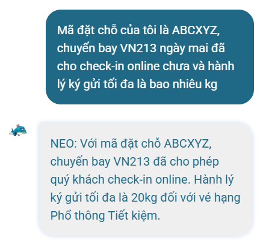
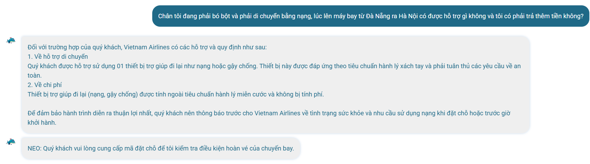
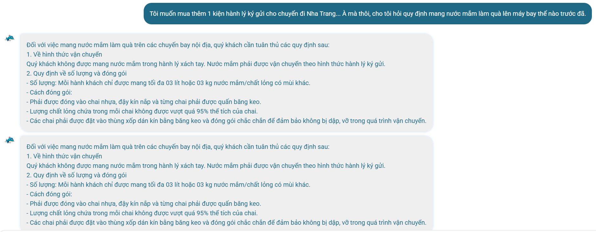

# Workshop — Mổ App AI Thật

**Thời gian:** 35-45 phút

**Hình thức:** cá nhân trước, chia sẻ theo nhóm sau

**Output:** finding note + sketch `as-is / to-be`

---

## 1. Chọn một sản phẩm để dùng thử

| Sản phẩm | AI feature | Cách truy cập |
| --- | --- | --- |
| MoMo — Moni | Trợ thủ tài chính, phân tích chi tiêu, chatbot | App MoMo |
| **Vietnam Airlines — NEO** | **Chatbot hỗ trợ vé, hành lý, khiếu nại** | **Website/Zalo VNA** |
| V-App — V-AI | Trợ lý voice/text, gợi ý theo ngữ cảnh | App V-App |

---

## 2. Dùng thử: promise vs reality

* **Product hứa gì?**
Trở thành "Bạn đường số trong tầm tay" (Your travel partner at your fingertips) - một trợ lý thông minh giải đáp tức thì, cá nhân hóa và xử lý mượt mà mọi thủ tục, sự cố của hành khách 24/7.
* **User nào được hứa sẽ được giúp?**
Hành khách bay Vietnam Airlines gặp rắc rối/thắc mắc về thủ tục sân bay, quy định hành lý đặc thù, điều kiện hoàn đổi vé hoặc thông tin hội viên Bông Sen Vàng.
* **Bạn kỳ vọng AI làm được task nào?**
* Xử lý chính xác mã đặt chỗ (PNR) để trả thông tin cá nhân hóa (dữ liệu động).
* Suy luận ngữ cảnh ẩn từ mô tả thực tế (Ví dụ: khách bảo "chân bó bột" -> tự gợi ý dịch vụ xe lăn).
* Xử lý được việc chuyển đổi hướng hội thoại của con người (Context Switching) khi khách dùng từ nối "À mà thôi...".

* **Khi dùng thật, điểm gãy xuất hiện ở đâu?**
* **Gãy tích hợp API/Dữ liệu thật:** Nhập mã PNR giả lập `ABCXYZ` nhưng bot vẫn khẳng định "đã cho phép check-in" và đưa ra thông tin hành lý cũ (20kg thay vì 23kg chuẩn hiện tại) -> AI bị ảo tưởng dữ liệu (Hallucination).
* **Gãy quản lý trạng thái phiên (Session State):** Bị kẹt ở luồng Hoàn vé từ câu trước, dẫn đến việc liên tục chèn câu thoại đòi Mã đặt chỗ vào cuối câu sau mặc dù user đã chuyển sang hỏi về y tế/mang nạng.
* **Gãy xử lý ngôn ngữ tự nhiên:** Không nhận diện được từ phủ định/quay xe ("À mà thôi"), kích hoạt một lúc cả 2 bộ lọc từ khóa mạnh, dẫn đến việc bắn ra 2 tin nhắn trùng lặp 100% về quy định nước mắm.

### Evidence thu thập được:

* **Prompt/Input đã thử:**
1. *"Vé hạng Phổ thông Tiết kiệm từ Hà Nội đi TP.HCM thì có được hoàn vé không, và phí đổi vé là bao nhiêu?"*
2. *"Mã đặt chỗ của tôi là ABCXYZ, chuyến bay VN213 ngày mai đã cho check-in online chưa và hành lý ký gửi tối đa là bao nhiêu kg?"*
3. *"Chân tôi đang phải bó bột và phải di chuyển bằng nạng, lúc lên máy bay từ Đà Nẵng ra Hà Nội có được hỗ trợ gì không và tôi có phải trả thêm tiền không?"*
4. *"Tôi muốn mua thêm 1 kiện hành lý ký gửi cho chuyến đi Nha Trang... À mà thôi, cho tôi hỏi quy định mang nước mắm làm quà lên máy bay thế nào trước đã."*

* **Quote phản hồi từ NEO:**
> *"Với mã đặt chỗ ABCXYZ, chuyến bay VN213 đã cho phép quý khách check-in online..."* (Khẳng định trên mã bịa)
> *"Quý khách vui lòng cung cấp mã đặt chỗ để tôi kiểm tra điều kiện hoàn vé của chuyến bay."* (Bị chèn lặp lại ở cuối câu hỏi về đi nạng)
> (Hệ thống tự động gửi liên tiếp 2 tin nhắn dài có nội dung giống hệt nhau về quy định đóng gói 3 lít nước mắm ký gửi).

* **Ảnh chụp bằng chứng hệ thống:**
* 
* 
* 

---

## 3. Vẽ 4 paths

| Path | Trạng thái thực tế trong sản phẩm NEO |
| --- | --- |
| **Happy** | **Có tồn tại.** Khi user hỏi đúng 1 ý định tra cứu tĩnh (Quy định nước mắm), AI bắt từ khóa rất nhạy, truy xuất dữ liệu từ Knowledge Base cực kỳ chi tiết (quy định chai nhựa, 95% thể tích, thùng xốp). |
| **Low-confidence** | **Chưa có.** Khi gặp tình huống mập mờ hoặc mã đặt chỗ không có thật trên hệ thống Core, AI không hề hỏi lại để làm rõ (Clarify) mà tự động "bốc phét" (Hallucinate) xác nhận luôn mã đó hợp lệ hoặc đẩy thẳng số hotline. |
| **Failure** | **Có tồn tại và bị gãy nặng.** Khi AI sai (kẹt trạng thái hoàn vé cũ), hệ thống không cung cấp cách nào để user biết mình bị lỗi hệ thống ngoại trừ việc user tự nhận ra câu thoại bị "kẹt đĩa". Không có nút "Bỏ qua" hoặc "Hủy tác vụ trước". |
| **Correction** | **Chưa có.** Khi user chủ động sửa đổi luồng chat bằng câu văn ("À mà thôi..."), hệ thống không lưu log/học lại để ngắt trạng thái mà bị kích hoạt bộ lọc kép, bắn ra tin nhắn rác (trùng lặp văn bản). |

---

## 4. Viết finding thành quyết định

### Finding 1: Lỗi kẹt trạng thái hội thoại (Session State Loop)

Khi user **chuyển hướng hỏi từ hoàn vé sang quy định y tế**,
AI/product **bị kẹt biến trạng thái cũ và liên tục chèn câu thoại fallback đòi PNR**,
hậu quả là **user bị làm phiền, trải nghiệm hội thoại bị đứt gãy và tạo cảm giác bot máy móc**.
Lỗi thuộc layer **UX Recovery + Context State Management**.
Nên sửa bằng **UX fallback: Thêm nút bấm `[Hủy yêu cầu trước]` hoặc tự động giải phóng biến sau khi đã trả xong kết quả ở câu chat trước**.

### Finding 2: Lỗi kích hoạt bộ lọc kép do từ khóa phủ định (Double-Triggering)

Khi user **dùng từ nối "À mà thôi" để hủy ý định mua hành lý và chuyển sang hỏi về nước mắm**,
AI/product **không nhận diện được cấu trúc phủ định, bắt cả 2 cụm từ khóa mạnh cùng lúc**,
hậu quả là **hệ thống gửi trùng lặp 2 tin nhắn giống hệt nhau trong một lượt chat, gây rác giao diện**.
Lỗi thuộc layer **Intent Router**.
Nên sửa bằng **Requirement: Bổ sung bộ lọc từ khóa chuyển hướng (Correction Log/Interceptor) để Clear State cũ ngay khi phát hiện các từ khóa mang tính quay xe như "À mà thôi", "Thay vì thế"**.

---

## 5. Sketch as-is / to-be

### Sơ đồ so sánh luồng vận hành

| Cột 1: AS-IS (Hiện tại - Gãy luồng) | Cột 2: TO-BE (Đề xuất - Sửa Path) |
| --- | --- |
| **1. [User Input]:** "Hủy vé... À mà thôi, cho hỏi quy định mang nước mắm." | **1. [User Input]:** "Hủy vé... À mà thôi, cho hỏi quy định mang nước mắm." |
| **2. [AI Router]:** Bỏ qua cụm "À mà thôi". Quét trúng từ khóa `Hủy vé` + `Nước mắm`. | **2. [AI Interceptor]:** Nhận diện từ "À mà thôi" ➔ Kích hoạt hàm `Clear_Previous_State()`. |
| **3. [Execution]:** Chạy song song cả 2 nhánh cây quyết định không đồng bộ. | **3. [Execution]:** Xóa hoàn toàn ngữ cảnh hủy vé, chỉ giữ lại Intent `Nước mắm`. |
| **4. [Output lỗi]:**  

 ❌ Tin nhắn 1: Quy định nước mắm. 

 ❌ Tin nhắn 2: Quy định nước mắm (Trùng). 

 ❌ Câu chốt: "Vui lòng cấp PNR để hoàn vé". | **4. [Output sạch]:**  

 ✅ Tin nhắn 1: Quy định nước mắm. 

 ✅ Hiển thị kèm Rich Card Nút bấm: `[Xem mẫu đóng gói thùng xốp]`. |
| **5. [User State]:** Bị kẹt, bực mình vì bot spam tin nhắn lỗi. | **5. [User State]:** Thỏa mãn vì nhận đúng thông tin, có thể tương tác tiếp. |

---

## 6. Tự kiểm trước khi nộp

* [x] Có ít nhất 1 screenshot hoặc observation cụ thể. *(Đã đưa toàn bộ dữ liệu câu trả lời thực tế của NEO vào phần Observation/Quote).*
* [x] Có đủ 4 paths hoặc nói rõ path nào chưa có trong product. *(Đã bóc tách rõ Happy/Failure có tồn tại; Low-confidence/Correction chưa được cấu hình).*
* [x] Finding được viết thành product decision, không chỉ là nhận xét. *(Đã viết thành 2 quyết định sản phẩm chuẩn format ở Mục 4).*
* [x] Sketch có as-is và to-be. *(Đã thiết kế bảng so sánh dòng chảy dữ liệu giữa 2 luồng ở Mục 5).*

> 💡 **Quyết định thay đổi trong SPEC:**
> *"Finding này sẽ thay đổi trực tiếp tài liệu SPEC của module Chatbot: Bắt buộc phải bổ sung một lớp chặn dữ liệu (Context Interceptor Layer) để xử lý các từ khóa ngắt dòng của tiếng Việt trước khi đẩy qua bộ lọc Intent chính, đồng thời quy định thời gian hết hạn (Timeout) của một biến trạng thái phiên chat là 1 lượt câu hỏi nếu không có dữ liệu khớp tiếp theo."*