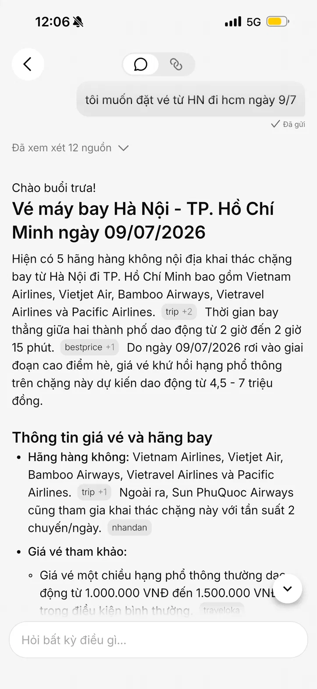
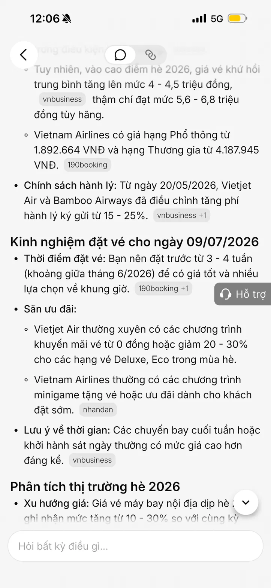
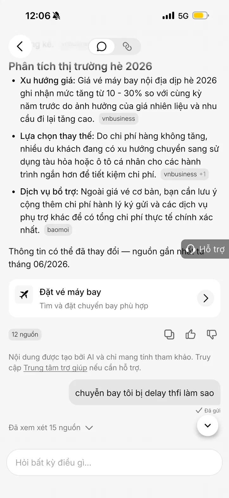
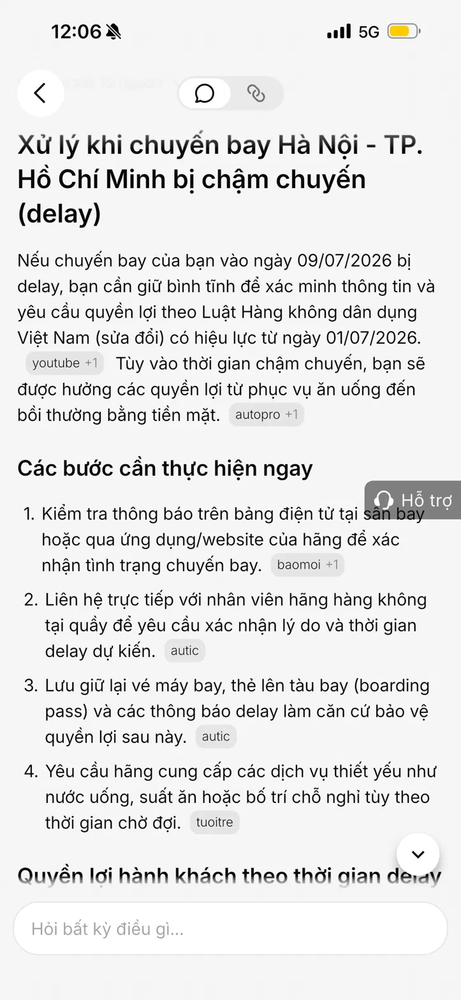
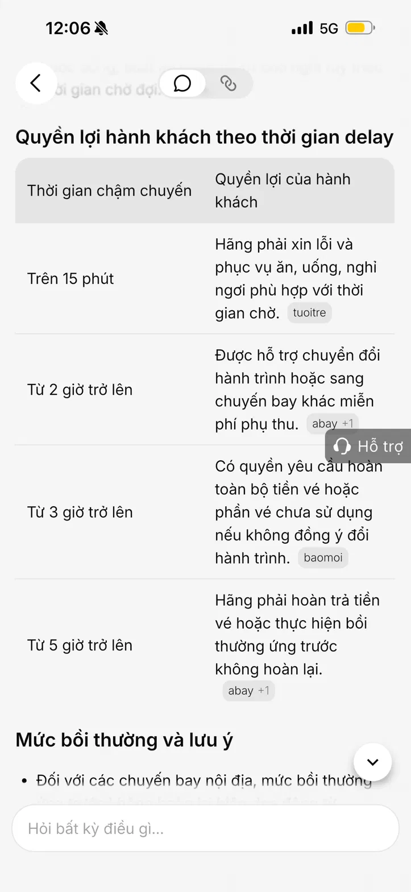
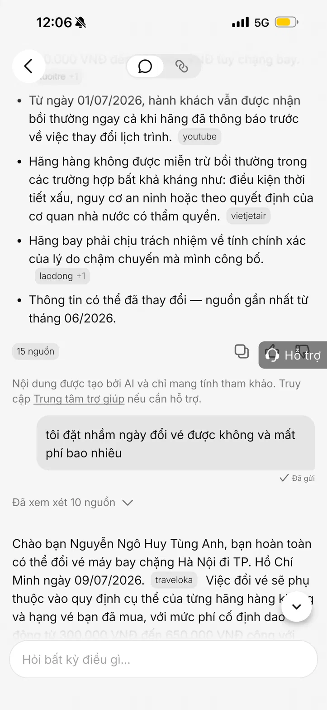
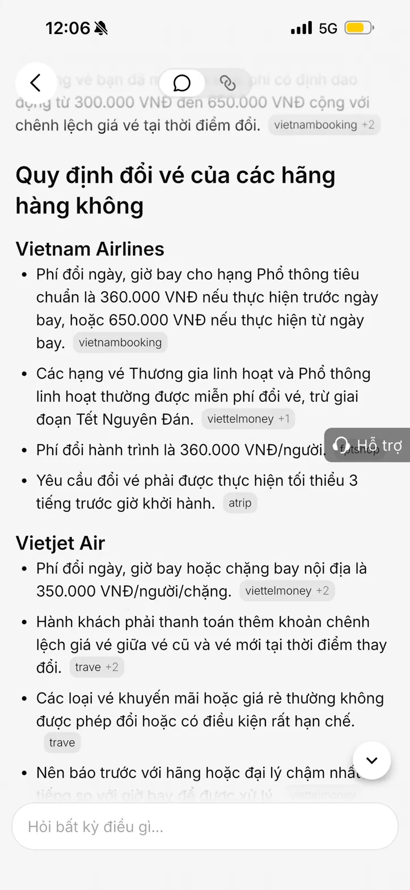
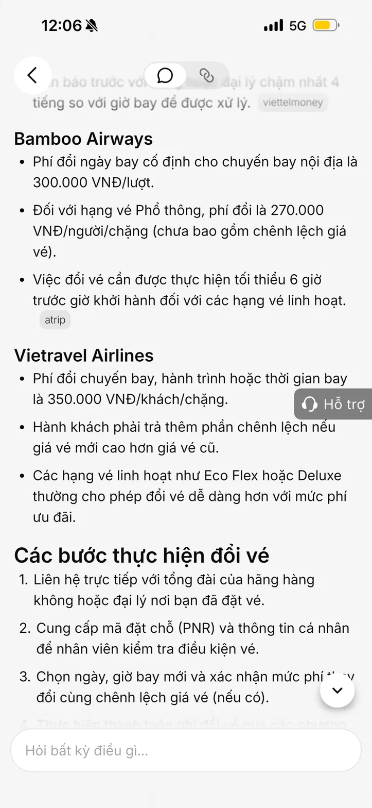
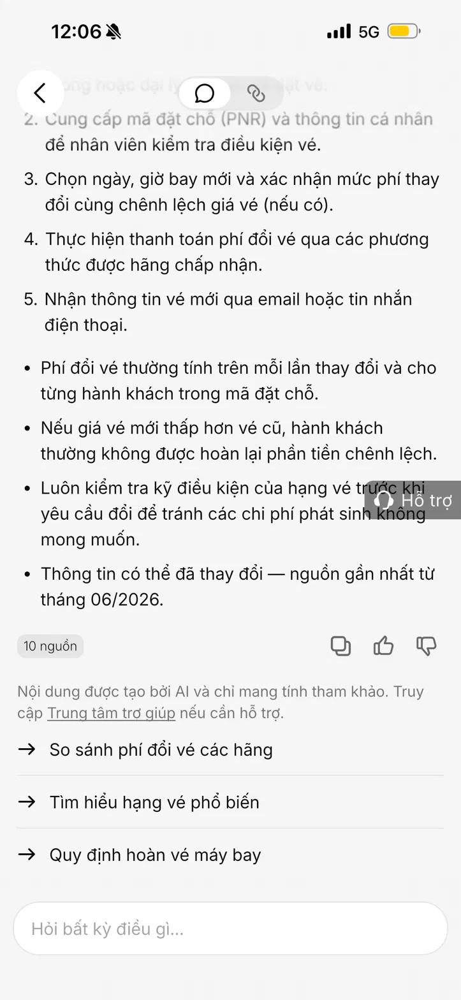

# Workshop — Mổ App AI Thật

**Họ tên:** Nguyễn Ngô Huy Tùng Anh  
**MSSV:** 2A202600613 
**Thời gian:** 35–45 phút  
**Hình thức:** Cá nhân trước, chia sẻ theo nhóm sau  
**Output:** Finding note + sketch `as-is / to-be`

Mục tiêu không phải chấm "UI đẹp hay xấu". Mục tiêu là dùng sản phẩm thật như một bài needfinding: tìm chỗ product gãy trong workflow thật, rồi viết finding đó thành quyết định product.

---

## 1. Chọn một sản phẩm để dùng thử

| Sản phẩm | AI feature | Cách truy cập |
|---|---|---|
| **V-App — V-AI** ✅ | Trợ lý chat AI, tư vấn đặt vé máy bay, hỗ trợ xử lý sự cố chuyến bay trong siêu ứng dụng Vingroup | App V-App (VinSmart Future — Vingroup) |

**Mô tả:** V-AI là trợ lý ảo tích hợp trong hệ sinh thái V-App của Vingroup — kết nối các dịch vụ Vinhomes, Vinpearl, VinFast, VinMart trong cùng một siêu ứng dụng. Trong session này, V-AI được test với use case đặt vé máy bay và xử lý sự cố chuyến bay — một trong các workflow thường gặp nhất của user.

---

## 2. Dùng thử: promise vs reality

**Product hứa gì?**  
Trợ lý thông minh hiểu context của user trong hành trình — tra cứu thông tin, tư vấn chính sách, hỗ trợ xử lý sự cố và kết nối hành động thực tế trong 1 luồng chat.

**User nào được hứa sẽ được giúp?**  
User V-App cần tra cứu chuyến bay, đặt vé, xử lý tình huống phát sinh (delay, đổi vé, hoàn vé) — đặc biệt trong các tình huống có time pressure cao.

**Kỳ vọng AI làm được task nào?**
- Tư vấn đặt vé theo route và ngày cụ thể với giá chính xác
- Hướng dẫn xử lý sự cố (delay, đổi vé) và kết nối action ngay
- Hỗ trợ user thực hiện được giao dịch trong cùng 1 luồng chat

---

**Điểm gãy quan sát được:**

### Query 1: Đặt vé theo route cụ thể
> **"tôi muốn đặt vé từ HN đi HCM ngày 9/7"**

![Query 1 — Đặt vé HN→HCM]
![Query 1 — Kết quả tổng hợp]

| | |
|---|---|
| **Kỳ vọng** | Hiển thị chuyến bay thật + giá thật → đặt vé ngay trong app |
| **Thực tế** | Trả về thông tin tổng hợp (hãng bay, giá tham khảo, mẹo đặt vé) + 1 CTA button "Đặt vé máy bay" dẫn ra ngoài |
| **Điểm gãy** | ⚠️ Low-confidence — có context ngày cụ thể nhưng không hiển thị chuyến bay thật, không đặt được trong chat |

---

### Query 2: Xử lý sự cố — delay
> **"chuyến bay tôi bị delay thì làm sao"**

![Query 2 — Hỏi về delay]
![Query 2 — Bảng quyền lợi delay]
![Query 2 — Quyền lợi theo thời gian]

| | |
|---|---|
| **Kỳ vọng** | Xác nhận chuyến bay cụ thể của user → hướng dẫn theo tình huống thật → kết nối action |
| **Thực tế** | Trả về bảng quyền lợi chung theo thời gian delay (15 phút / 2h / 3h / 5h), không hỏi về chuyến bay cụ thể, không có CTA nào sau khi đọc xong |
| **Điểm gãy** | ⚠️ Generic info + Dead end — không có nút kiểm tra trạng thái chuyến bay, không có nút liên hệ hỗ trợ |

---

### Query 3: Multi-intent — đổi vé + tính phí
> **"tôi đặt nhầm ngày, đổi vé được không và mất phí bao nhiêu"**

![Query 3 — Hỏi đổi vé]
![Query 3 — Bảng phí đổi vé các hãng]
![Query 3 — Bảng phí tiếp theo]
![Query 3 — Các bước thực hiện đổi vé]

| | |
|---|---|
| **Kỳ vọng** | Kéo đơn vé thật → tính phí đổi chính xác theo hạng vé → thực hiện đổi ngay |
| **Thực tế** | Nhận diện đúng context (chuyến HN→HCM 9/7, đúng tên user), trả về bảng phí đổi vé từng hãng chung chung, không có nút "Đổi vé ngay" |
| **Điểm gãy** | 🔴 Action gap — AI nhớ context rất tốt nhưng sau khi có thông tin, user vẫn bị bỏ lại tự tìm cách đổi vé |

---

## 3. Vẽ 4 paths

| Path | Quan sát thực tế trong V-AI |
|---|---|
| **Happy** | Khi query đơn giản, câu trả lời là thông tin công khai (giá tham khảo, hãng bay, thời gian bay) → V-AI trả lời đúng, nhanh, có CTA ✅ |
| **Low-confidence** | Khi query cần dữ liệu thật (chuyến bay cụ thể, giá theo khung giờ) → V-AI không hỏi lại, trả thông tin tổng hợp chung, không có clarification ⚠️ |
| **Failure** | Khi query cần dữ liệu tài khoản/đơn vé thật của user → V-AI không kéo được dữ liệu thật, trả chính sách chung ❌ |
| **Correction** | Khi user cần thực hiện action (đổi vé, liên hệ hỗ trợ delay) → V-AI trả thông tin xong rồi dừng, không có handoff action 🔴 |

```
User nhập query
        │
        ▼
V-AI nhận input → Search nguồn (10–15 nguồn)
        │
        ├─ [Happy path] ──────────────────────► Hiểu đúng intent → Trả lời + CTA đặt vé ✅
        │
        ├─ [Low-confidence] ──────────────────► Trả thông tin tham khảo chung ⚠️
        │                                        Không hỏi lại context cụ thể
        │
        ├─ [Cần data thật của user] ──────────► Trả chính sách chung ❌
        │                                        Không kéo được đơn vé thật
        │
        └─ [Cần thực hiện action] ────────────► Trả thông tin → Dừng 🔴
                                                 Không có CTA đổi vé / liên hệ / check status
```

**User bị kẹt nhiều nhất tại:** Bước "Cần action" — V-AI dừng ở lớp thông tin, không bridge sang hành động thực tế dù đã nhận diện đúng intent và context của user.

---

## 4. Viết finding thành quyết định

**Finding 1 — Low-confidence không có clarification:**

```
Khi user hỏi route và ngày cụ thể ("đặt vé HN đi HCM ngày 9/7"),
V-AI không kéo chuyến bay thật mà tổng hợp thông tin chung từ nhiều nguồn,
hậu quả là user nhận được giá tham khảo không phải giá đặt được thật,
phải thoát app để tìm chuyến bay riêng.
Lỗi thuộc layer data-tool: thiếu tích hợp flight search API thật.
Nên sửa bằng: tích hợp flight API để V-AI hiển thị chuyến bay thật
theo ngày/route → chọn và đặt ngay trong chat.
```

**Finding 2 — Dead end sau response (case ưu tiên):**

```
Khi user gặp sự cố (delay, đổi vé) và hỏi V-AI,
V-AI trả về thông tin chính sách đúng nhưng không cung cấp action tiếp theo,
hậu quả là user đọc xong không biết làm gì — không có nút kiểm tra chuyến bay,
không có nút liên hệ hỗ trợ, không có nút đổi vé trực tiếp.
Lỗi thuộc layer UX recovery: thiếu contextual action buttons sau response.
Nên sửa bằng: thêm action buttons phù hợp theo context của từng response
(delay → [Kiểm tra trạng thái] [Liên hệ hỗ trợ];
đổi vé → [Đổi vé trên app] [Gọi tổng đài 1900 1100]).
```

**Finding 3 — Action gap sau multi-intent query:**

```
Khi user xác nhận rõ intent ("đặt nhầm ngày, muốn đổi vé"),
V-AI nhận diện đúng context (tên user, chuyến bay) nhưng chỉ trả bảng phí đổi vé chung,
hậu quả là user biết được phí nhưng vẫn phải tự tìm cách đổi ở nơi khác.
Lỗi thuộc layer data-tool + action: không có booking API, không có action button thật.
Nên sửa bằng: tích hợp booking API để kéo đơn vé thật
→ tính phí đổi chính xác theo hạng vé
→ nút [Xác nhận đổi vé] với confirm 2 bước trước khi thực hiện.
```

---

## 5. Sketch as-is / to-be

### As-is (flow hiện tại — Query 2 & 3)

```
User: "Chuyến bay bị delay thì làm sao?"
hoặc: "Đặt nhầm ngày, đổi vé được không?"
        │
        ▼
V-AI search 10–15 nguồn
        │
        ▼
Trả về: Thông tin chính sách / bảng quyền lợi chung
        ⚠️ [Không theo đơn vé thật, không biết chuyến bay cụ thể của user]
        │
        ▼
[Cuối response — không có action button phù hợp]  ❌
        │
        ▼
User tự thoát app → tìm số hotline → gọi → chờ
🔴 [Friction cao, time pressure nếu có deadline đổi/hoàn vé]
```

**Điểm gãy:** V-AI dừng ở lớp thông tin — không bridge sang action, không handoff có context.

---

### To-be (flow đề xuất)

```
User: "Chuyến bay bị delay thì làm sao?"
        │
        ▼
V-AI detect intent = sự cố
→ Hỏi: "Bạn cho mình biết số hiệu chuyến bay?"
        │
        ▼
Trả về thông tin quyền lợi theo thời gian delay
        │
        ▼
Contextual action buttons:
[🔍 Kiểm tra trạng thái chuyến bay]
[📞 Liên hệ hỗ trợ ngay]
[🔄 Đổi chuyến bay khác]
        │
        ▼
User chọn action → thực hiện trong app
hoặc handoff với full context ✅

─────────────────────────────────────────

User: "Đặt nhầm ngày, đổi vé được không?"
        │
        ▼
V-AI kéo đơn vé gần nhất (sau xác thực)
hoặc hỏi mã đặt chỗ
        │
        ▼
Hiển thị:
  Chuyến HN → HCM · 09/07/2026 · Hạng Phổ thông
  Phí đổi vé: 360.000 VNĐ + chênh lệch giá (nếu có)
        │
        ▼
V-AI hỏi: "Bạn muốn đổi sang ngày nào?"
        │
        ▼
[Xác nhận đổi vé]
→ Confirm lần 2
→ Thực hiện
→ Gửi email xác nhận ✅
```

**So sánh chi tiết As-Is vs To-Be:**

| Yếu tố | As-Is | To-Be |
|---|---|---|
| **Source dữ liệu** | Tổng hợp từ nguồn web công khai | Kéo đơn vé thật qua booking API |
| **Clarification** | Không hỏi lại | Xác nhận số hiệu chuyến / ngày muốn đổi |
| **Tính phí đổi vé** | Bảng phí chung theo hãng | Số tiền cụ thể theo đơn vé và hạng vé thật |
| **Action sau response** | Không có | Contextual buttons theo từng tình huống |
| **Confirm trước action** | Không có | Confirm 2 bước trước khi đổi/huỷ thật |
| **Handoff sang hỗ trợ** | User tự gọi hotline | Connect thẳng với full context đính kèm |
| **Time alert** | Không có | Alert nếu gần deadline đổi/hoàn vé |

---

## 6. Tự kiểm trước khi nộp

- [x] Có ít nhất 3 observation cụ thể — 3 query thật với input/output quan sát được (9 screenshots).
- [x] Có đủ 4 paths — Happy ✅ / Low-confidence ⚠️ / Failure ❌ / Correction 🔴 đều có observation.
- [x] Finding được viết thành product decision theo format chuẩn, không chỉ là nhận xét.
- [x] Sketch có as-is và to-be với flow chi tiết, đánh dấu điểm gãy và điểm sửa.
- [x] Finding sẽ đổi SPEC: **tích hợp contextual action buttons + booking API** để V-AI không chỉ trả thông tin mà bridge được sang action thực tế ngay trong luồng chat.

---

## Product Decision

> **"V-AI hiện dừng ở lớp thông tin — hiểu đúng intent và context của user nhưng không cung cấp action tiếp theo, khiến user phải tự tìm cách xử lý sau khi đọc xong. Ưu tiên sửa: thêm contextual action buttons phù hợp theo từng tình huống (delay → kiểm tra trạng thái / liên hệ hỗ trợ; đổi vé → xác nhận đổi ngay), đồng thời tích hợp booking API để V-AI kéo được đơn vé thật, tính phí chính xác theo context và thực hiện action với confirmation 2 bước — thay vì để user thoát app và tự xử lý."**