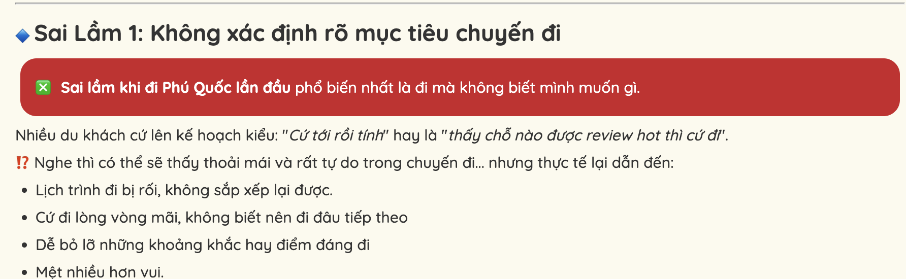
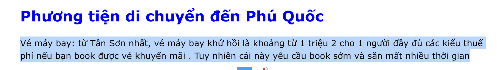
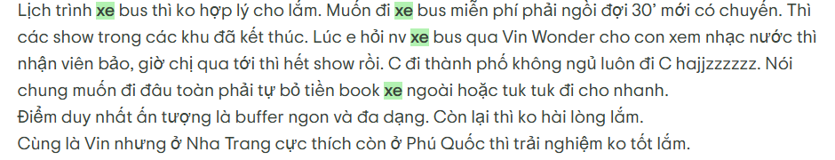
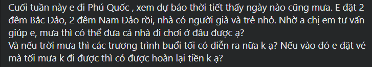

# 7 Artifact Cuối Day 05 — AI Gợi Ý Lịch Trình Du Lịch Vinpearl
## 1. Evidence pack

_Cần: User/pain có bằng chứng, không tự bịa. Có self-use + ít nhất một nguồn ngoài nhóm hoặc kế hoạch lấy nguồn rõ._

**Self-use:** Nhóm đóng vai khách lần đầu đi Phú Quốc, tự lên lịch 2N1Đ bằng web Vinpearl + Google Maps.

- Phải mở ~6 tab (vé VinWonders, Safari, bản đồ, giá phòng, blog) mới ghép xong lịch 1 ngày.
- Không chắc VinWonders + Safari có đi chung 1 ngày kịp không (giờ mở cửa, di chuyển).
- Thấy banner ưu đãi nhưng không rõ áp cho ngày mình đi.

**Nguồn:**

| Pain | Quote / dẫn chứng | Nguồn | Ảnh chụp |
|---|---|---|---|
| Lần đầu bối rối, lịch trình bị rối | "Sai lầm phổ biến nhất là **đi mà không biết mình muốn gì**… dẫn đến **lịch trình đi bị rối, không sắp xếp lại được**" | [phuquocsanhodo.com](https://phuquocsanhodo.com/top-5-sai-lam-khi-di-phu-quoc-lan-dau-ban-nen-tranh.html) · [Klook Blog](https://www.klook.com/vi/blog/kinh-nghiem-du-lich-phu-quoc-tu-tuc/) |  |
| Tự tìm thông tin, mất thời gian | Người lần đầu tự túc phải tự lo "phương tiện di chuyển, lưu trú, lịch trình tham quan"; nhiều tình huống mất thời gian, chênh giờ tàu xe gây mệt | [phuquocxanh.com](https://phuquocxanh.com/vi/di-du-lich-phu-quoc-2-ngay-1-dem-tu-tuc/) |  |
| Sợ sắp sai giờ / điểm đóng cửa | "…đủ khám phá **nếu biết cách sắp xếp hợp lý**… tránh điểm tham quan đóng cửa vào ngày/giờ cụ thể" | [vinwonders.com](https://vinwonders.com/vi/wonderpedia/news/lich-trinh-du-lich-phu-quoc/) · [Tripadvisor](https://www.tripadvisor.com/Hotel_Review-g12666019-d6920092-Reviews-Vinpearl_Resort_Spa_Phu_Quoc-Ganh_Dau_Phu_Quoc_Island_Kien_Giang_Province.html) |  |
| Thắc mắc về thời tiết theo thời gian thực | "Khách du lịch luôn muốn biết được **thời tiết ở nơi mình đến có đẹp không hoặc đi vào ngày nào thì thời tiết đẹp nhất**"; voucher giảm 20–55% | [hethongvinpearlresort.com](https://hethongvinpearlresort.com/vinperl-phu-quoc.html) · [banvouchervinpearlgiare.com](https://banvouchervinpearlgiare.com/) |  |
| Comment người thật xin sắp lịch trình | "Nhiều người dùng muốn tìm lịch trình trên các hội nhóm fb **(90+ post/ngày)**" | [Group Review Phú Quốc](https://www.facebook.com/groups/reviewphuquocvn/) |  |

---

## 2. Opportunity statement

_Cần: Bằng chứng nói gì sâu hơn về user; vì sao đây là việc đáng sửa._

```text
User khách lần đầu đi Phú Quốc không thiếu thông tin — họ chết ở khâu TỔNG HỢP và SẮP GIỜ:
mở nhiều tab, tự đoán giờ di chuyển, không chắc ưu đãi/phòng nào áp được cho ngày mình đi.

Sâu hơn: họ không cần thêm 3 danh sách (địa điểm / phòng / ưu đãi) tách rời.
Họ cần MỘT lịch trình đã-sắp-sẵn-và-đáng-tin: đúng giờ, hợp nhu cầu, chỉ hiện ưu đãi/phòng CÓ THẬT.

Đáng sửa vì: sắp lịch sai → phí cả chuyến đi đắt tiền; hiểu nhầm ưu đãi → mất tiền, mất niềm tin.
```

---

## 3. Build slice

_Cần: Một user, một task, một AI decision, một output. Không build cả app._

```text
Cho khách lần đầu đi Phú Quốc 2N1Đ đang tự ghép lịch trình,
prototype dùng AI để hỏi 3 câu (đi với ai / ngân sách / thích biển hay vui chơi)
   rồi đề xuất MỘT lịch trình timeline 2N1Đ, gắn 1 khu phòng Vinpearl phù hợp
   và tối đa 1 ưu đãi đang áp dụng cho ngày đó,
tạo ra một timeline sáng/chiều/tối kèm lý do từng lựa chọn,
và xử lý "AI bịa ưu đãi/phòng" bằng cách chỉ chọn từ dữ liệu có thật + nút "xem nguồn".
```

- **1 user:** khách lần đầu, Phú Quốc, 2N1Đ.
- **1 task:** lên lịch trình.
- **1 AI decision:** ghép lịch + chọn phòng + chọn ưu đãi khớp.
- **1 output:** timeline có lý do.

---

## 4. Auto/Aug decision

_Cần: AI gợi ý hay tự làm? Human giữ quyền ở đâu?_

**Augmentation** — AI gợi ý lịch trình + phòng + ưu đãi, **user quyết cuối** (đổi giờ, đổi phòng, bỏ ưu đãi).
**Vì sao:** liên quan tiền (phòng) và sở thích cá nhân; rủi ro AI bịa giá/ưu đãi cao → không để AI tự hành động.
**Human role:** decider.

---

## 5. Four paths

_Cần: Happy, low-confidence, failure, correction._

| Path               | Prototype thể hiện                                                                 |
| ------------------ | ---------------------------------------------------------------------------------- |
| **Happy**          | Trả lời đủ 3 câu → ra timeline 2N1Đ + 1 khu phòng + 1 ưu đãi khớp ngày, kèm lý do  |
| **Low-confidence** | Ngân sách "tùy"/mơ hồ → AI hỏi lại 1 câu làm rõ thay vì đoán bừa                   |
| **Failure**        | Không có ưu đãi cho ngày đó → AI nói thẳng "chưa có ưu đãi phù hợp", **không bịa** |
| **Correction**     | User đổi "thích biển" → "thích vui chơi" → lịch trình + phòng cập nhật lại         |

---

## 6. Failure mode

_Cần: Một lỗi nguy hiểm nhất và cách prototype xử lý._

```text
Nếu user hỏi ưu đãi/phòng cho một ngày cụ thể,
AI có thể BỊA một ưu đãi hoặc hạng phòng không tồn tại / đã hết hạn,
hậu quả là user đặt theo rồi không áp được → mất tiền, mất niềm tin.
Prototype xử lý bằng: chỉ chọn từ danh sách phòng/ưu đãi có thật (dữ liệu cố định nhóm chuẩn bị),
   luôn kèm nút "xem nguồn", khi không khớp thì show "chưa có" — tuyệt đối không tự sinh ưu đãi mới.
```

---

## 7. Owner plan

_Cần: Ai phụ trách research, SPEC, prototype, test, demo, repo._

| Vai trò             | Thành viên | Bằng chứng cần có trong repo                       |
| ------------------- | ---------- | -------------------------------------------------- |
| Research / evidence | Phạm Thị Tuyết Nga + Nguyễn Thái Hoàng  | Self-use screenshot + review thật                  |
| SPEC                | Phạm Thị Tuyết Nga | File 7 artifact này, cập nhật nếu evidence đổi     |
| Prototype           | Nguyễn Đức Toàn + Nguyễn Thái Hoàng + Phạm Thị Tuyết Nga + Nguyễn Ngô Huy Tùng Anh  | Demo: 3 câu hỏi → timeline + phòng + ưu đãi        |
| Test / failure path |  Nguyễn Đức Toàn + Nguyễn Thái Hoàng + Nguyễn Ngô Huy Tùng Anh | Log test "ngày không có ưu đãi" → AI nói "chưa có" |
| Demo / repo         | Phạm Thị Tuyết Nga  | Kịch bản demo 3-5 phút chạy đủ 4 paths             |
